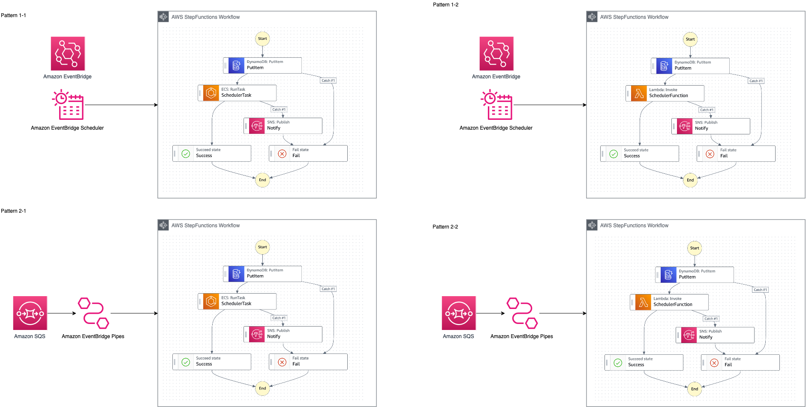

# Batch Architectures on AWS

## Architecture

## How to Deploy

- `npx projen deploy`

## Descriptions

- `src/lib/constructs/batch-processing-workflow.ts`
  - `EcsRunTask` or `LambdaInvoke` を引数に取り、排他制御・再試行・エラー通知を追加したステートマシンを構成する
- `src/lib/constructs/state-machine-queue.ts`
  -  ステートマシンを引数に取り、当該ステートマシンを SQS -> EventBridge Pipes -> Step Functions でトリガーする構成
- `src/lub/constructs/state-machine-scheduler.ts`
  - ステートマシンを引数に取り、当該ステートマシンを EventBridge Scheduler -> Step Functions でトリガーする構成
- `src/lib/batch-architectures-stack.ts`
  - {Pipes, Scheduler} x {EcsRunTask, LambdaInvoke} の各組み合わせの構成を構築するサンプル

## Directories

- `src/app/ticker`
  - ECS上で動作し、1分間1秒ごとにログを出力するアプリケーション
- `src/app/ticker-lambda`
  - コンテナ Lambda 上で動作し、1分間1秒ごとにログを出力するアプリケーション

## How to make snapshots

- `npx projen test`

